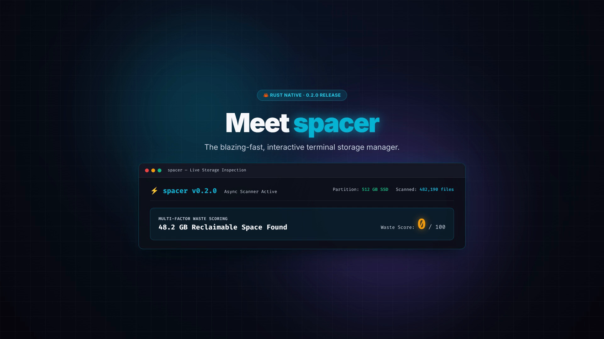
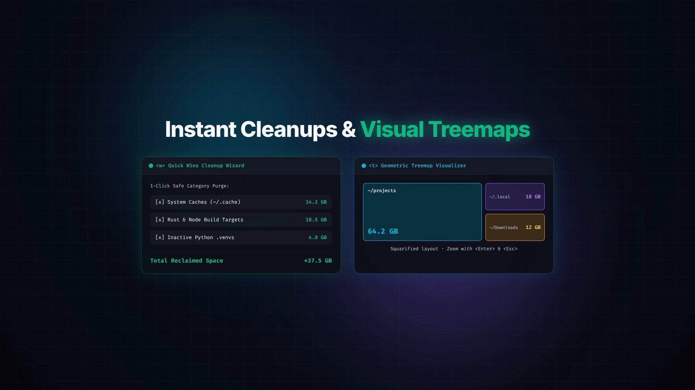
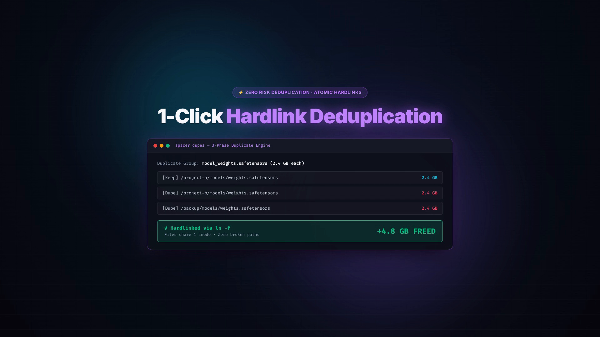

# spacer

A lightning-fast, interactive terminal storage manager and deduplicator written in Rust.

`spacer` scans your drives in real time, scores reclaimable waste (caches, build artifacts, stale logs, duplicate weights), and frees gigabytes in seconds without breaking your workflow.

[](assets/demo.mp4)

> 📹 **[Watch full high-res launch video (MP4)](assets/demo.mp4)**

---

```
⚡ SPACER │ Path: /home/user │ 💾 /home (/dev/nvme0n1p2) 84% used (79.2 GB free) [████████░░]
Sort: [SIZE] View: [LIST] │ Total: 142.8 GB (315 items) │ Status: ✓ Ready
┌── Explorer ─────────────────────────────────┐┌── Inspector ──────────────────────────────┐
│ [✓] 📁 .local       [FILE]      ████ 69.7 GB ││ Path: /home/user/.cache                   │
│ [ ] 📁 .cache       [PKG-CACHE] ██░░ 29.8 GB ││ Type: Directory (822,476 items)           │
│ [✓] 📁 .npm         [PKG-CACHE] █░░░ 11.7 GB ││ Size: 29.77 GB (31,963,566,457 bytes)     │
│ [ ] 📁 .rustup      [PKG-CACHE] ░░░░  2.6 GB ││                                           │
│ [✓] 📁 target       [DEV-BUILD] ░░░░  2.1 GB ││ Deletion Priority: 88/100 (HIGH WASTE)    │
│ [ ] 📁 .gradle      [DEV-BUILD] ░░░░  1.3 GB ││ • Size Impact:      100/100 [■■■■■■■■■■]  │
│ [ ] 📁 .bun         [PKG-CACHE] ░░░░  1.2 GB ││ • Inactivity/Age:   85/100  [■■■■■■■■  ]  │
│ [ ] 📁 .lmstudio    [AI-MODEL]  ░░░░  6.2 GB ││ • Category Heuristic:95/100 [■■■■■■■■■ ]  │
└─── Explorer ────────────────────────────────┘└─── Inspector ─────────────────────────────┘
 [Space] Stage  [d] Trash  [D] Permanent  [t] Treemap  [w] QuickWins  [F] Dupes  [s] Sort  [q] Quit
```

---

## ⚡ Quick Install

### One-line installer (Linux & macOS)
```bash
curl -fsSL https://raw.githubusercontent.com/meow687687/spacer/main/install.sh | bash
```

### From source (Cargo)
```bash
cargo install --git https://github.com/meow687687/spacer.git
```

### From local clone
```bash
git clone https://github.com/meow687687/spacer.git
cd spacer
./install.sh
```

---

## 📸 Screenshots & Highlights

<div align="center">

### 1. Intelligent Waste Scoring & Drive Monitor


*Real-time streaming scanner with multi-factor waste scoring (Size + Age + Heuristics).*

---

### 2. Quick Wins Cleanup & Squarified Treemaps


*1-Click discovery of disposable caches and interactive zoomable treemaps (`<t>`).*

---

### 3. Atomic Hardlink Deduplication (`ln -f`)


*Find duplicate multi-gigabyte files and collapse them into single inodes with zero broken paths.*

</div>

---

## What makes spacer different?

Most disk usage tools (`ncdu`, `dua`, `dust`) show you raw sizes, but leave you guessing whether a 10 GB folder is a critical virtual machine image or just disposable `node_modules` from a tutorial project you haven't touched in 8 months.

`spacer` combines size analysis with heuristic waste scoring and safe batch operations:

* **Instant UI feedback**: Starts streaming top-level folder sizes immediately while indexing deep subtrees asynchronously in the background.
* **Waste Prioritization (0–100 Score)**: Combines size footprint (45%), inactivity/age (30%), and category rules (25%) so rebuildable dev junk floats straight to the top.
* **Smart "Quick Wins" Wizard (`w` / `spacer clean`)**: One-key discovery of safe targets (`target/`, `.npm`, `~/.cache`, huggingface model blobs, core dumps).
* **Duplicate Detection + Hardlinks (`F` / `spacer dupes`)**: Finds byte-identical files using a 3-stage hashing pipeline (Size $\rightarrow$ 4KB prefix $\rightarrow$ SHA-256) and can replace duplicates with hardlinks (`ln -f`) to reclaim 100% of the duplicate space without breaking file paths.
* **Dual views**: Switch instantly between the classic table explorer and an interactive squarified treemap (`t`) with zoom in (`Enter`) and zoom out (`Backspace`).
* **Safe by default**: Deletions default to System Trash (`~/.local/share/Trash` via Freedesktop spec) with full confirmation dialogs, so mistakes are easily undone.

---

## Keybindings

### Navigation & Views
| Key | Action |
|---|---|
| `k` / `↑` | Move cursor up |
| `j` / `↓` | Move cursor down |
| `Enter` / `l` / `→` | Enter directory / Zoom into treemap block |
| `Backspace` / `h` / `←` | Parent directory / Zoom out treemap |
| `t` | Toggle View Mode (Table List ↔ Squarified Treemap) |
| `g` / `Home` | Jump to first item |
| `G` / `End` | Jump to last item |

### Cleanup & Deletion
| Key | Action |
|---|---|
| `Space` | Toggle stage/unstage for batch delete |
| `a` | Select / deselect all visible items |
| `c` | Clear staged selection |
| `d` | Open deletion confirmation (**Move to Trash**) |
| `D` (`Shift+D`) | Open permanent deletion confirmation (`rm -rf`) |
| `w` | Open **Quick Wins** cleanup wizard |
| `F` (`Shift+F`) | Open **Duplicate File Finder** & hardlink deduplicator |

### Sorting & Search
| Key | Action |
|---|---|
| `s` | Cycle sort (Size ↓, Waste Score ↓, Age ↓, Name A-Z) |
| `/` | Filter items by name in real time |
| `r` | Rescan current folder |
| `u` | View and trigger in-place update (when new version is available) |
| `?` | Help screen |
| `q` | Quit |

---

## CLI Commands

You can also run `spacer` headlessly in scripts or terminals without opening the TUI:

```bash
# Launch interactive TUI (defaults to current directory)
spacer [PATH]

# Print top 20 largest files/directories
spacer top 20 --path ~

# Dry-run Quick Wins cleanup to see how much space can be freed
spacer clean --dry-run
spacer clean --path ~

# Scan for duplicates and print identical file clusters
spacer dupes ~

# Replace all duplicate files with hardlinks in one command
spacer dupes /path/to/data --hardlink

# Export full directory tree and waste scores for audits
spacer export --path ~ --json report.json --csv report.csv

# Self-update binary in-place to the latest GitHub release
spacer update
```

---

## Build & Test

Requires Rust 1.80+ (edition 2024 / 2021).

```bash
# Run test suite
cargo test

# Build optimized binary
cargo build --release

# Binary will be at target/release/spacer
```

---

## License

MIT License.
